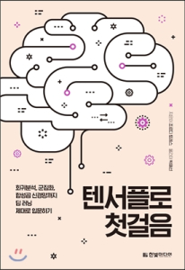

# 텐서플로 첫걸음

이 레파지토리는 "[텐서플로 첫걸음](https://tensorflow.blog/%ED%85%90%EC%84%9C%ED%94%8C%EB%A1%9C-%EC%B2%AB%EA%B1%B8%EC%9D%8C/)" 책의 예제를 담고 있습니다. 책에 대한 자세한 내용은 옮긴이의 블로그 [http://tensorflow.blog](http://tensorflow.blog)를 참고해 주세요.

### 책의 오탈자나 코드에 오류가 있는 경우 이슈를 남겨 주시거나 [이곳](https://tensorflowkorea.wordpress.com/%ED%85%90%EC%84%9C%ED%94%8C%EB%A1%9C-%EC%B2%AB%EA%B1%B8%EC%9D%8C/)에 글을 남겨 주세요.

- 주피터 노트북의 코드는 파이썬 3.5.x 와 텐서플로 v0.9, v0.10, v0.11, v0.12, v1.0, v1.1.0, v1.2.0, v1.3.0, v1.4.0, v1.5.0, v1.6.0, v1.7.0, v1.8.0, v1.9.0, v1.10.0, v1.11.0에서 테스트 되었습니다.
- chapter2-6 은 2장에서 6장까지의 주피터 노트북 예제를 모아 놓았습니다
- rnn_ptb는 한국어판 부록에 포함된 RNN 예제입니다
